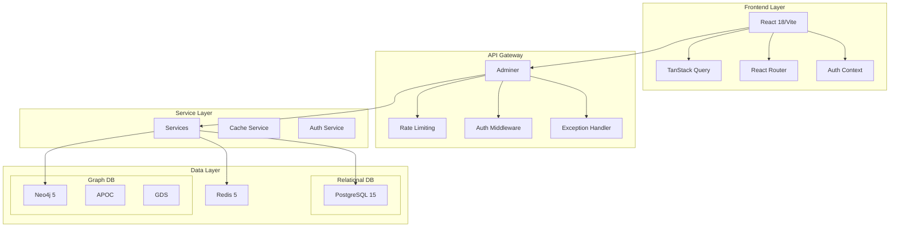

# Arquitectura del Observatorio Tecnológico Industrial

## Visión General

El Observatorio Tecnológico Industrial es una plataforma SaaS de inteligencia estratégica que opera como servicio digital bajo la rectoría del Ministerio de Industrias de Cuba (MINDUS). Monitorea tendencias globales en ciencia, tecnología e innovación para sectores industriales cubanos.

## Componentes Principales

### 1. Frontend (React 18 + TypeScript)
- **Framework**: React 18 con TypeScript 5.5
- **Bundler**: Vite 5.4 con HMR
- **Estilos**: Tailwind CSS 3.4
- **Estado**: TanStack Query 5
- **Forms**: React Hook Form + Zod
- **Componentes**: shadcn/ui (copiados al proyecto)

### 2. Backend (Python 3.11 + FastAPI)
- **Framework**: FastAPI >=0.110
- **Base de Datos**: SQLAlchemy 2.0 async con asyncpg
- **Migraciones**: Alembic
- **Validación**: Pydantic v2
- **Auth**: JWT (python-jose) + bcrypt
- **Rate Limiting**: slowapi
- **Logging**: loguru
- **Caching**: Redis wrapper

### 3. Base de Datos

#### PostgreSQL 15
- **Propósito**: Datos relacionales
- **Tablas**: Usuarios, tecnologías, patentes, organizaciones, indicadores, normativas, sectores industriales
- **Características**: JSONB, extensions, alta concurrencia

#### Neo4j 5 Community
- **Propósito**: Grafo de conocimiento industrial
- **APOC + GDS**: Para análisis avanzado
- **Características**: Grafo de relaciones entre tecnologías, empresas, patentes

#### Redis 5.0
- **Propósito**: Caché y sesión
- **Características**: Simple, rápido, Windows compatible

## Flujo de Datos

```
Usuario → Frontend (React) → Backend (FastAPI) →
├── PostgreSQL (SQLAlchemy) → API Responses
├── Neo4j (Cypher) → Graph Analytics
└── Redis (Cache) → Session Management
```

## Patrones de Diseño

### Backend Patterns
1. **Repository Pattern**: Acceso a datos abstracto
2. **Service Layer**: Lógica de negocio
3. **Factory Pattern**: Creación de clientes (Neo4j, Redis)
4. **Dependency Injection**: FastAPI DI
5. **Exception Handling**: AppException + handlers globales

### Frontend Patterns
1. **Component Pattern**: Componentes reutilizables
2. **Hook Pattern**: TanStack Query hooks
3. **Context Pattern**: AuthContext
4. **Route Pattern**: React Router con lazy loading
5. **Query Pattern**: Query keys `[\"entity\", params]`

## APIs

### REST API (/api/v1/)
- **Prefijo**: `/api/v1/` para todas las rutas
- **Autenticación**: JWT Bearer tokens
- **Rate Limiting**: slowapi en endpoints de auth
- **Respuesta**: PaginatedResponse[T] para listas

### Endpoints Principales
- `GET /api/v1/health` - Health check
- `POST /api/v1/auth/login` - Autenticación
- `GET /api/v1/auth/me` - Datos usuario actual
- `GET/POST /api/v1/technologies` - CRUD tecnologías
- `POST /api/v1/graph/sync` - Sincronizar grafo Neo4j

## Seguridad

### Autenticación
- **Algoritmo**: HS256
- **Token**: JWT con expiración (60 min)
- **Almacenamiento**: Sin estado (stateless)

### Autorización
- **Roles**: admin_mindus, cti_representative, analyst, visitor
- **Patrón**: `require_role` dependency

### CORS
- **Origins**: Configurable por entorno
- **Credenciales**: Permitidas para frontend

## Escalabilidad

### Horizontal
- **Frontend**: CDN + balanceo de carga
- **Backend**: Múltiples instancias con sticky sessions

### Vertical
- **Base de Datos**: Read replicas para PostgreSQL
- **Cache**: Cluster Redis

## Monitorización

### Métricas
- **Health Check**: `/api/v1/health`
- **Logs**: loguru con rotación (10MB, 30 días)
- **Métricas**: Prometheus exporter (futuro)

### Alertas
- **Umbrales**: CPU > 80%, Memoria > 85%
- **Tiempo de actividad**: > 99.9%
- **Errores**: > 5% en 5 minutos

## Backup y Recuperación

### Política de Backup
- **PostgreSQL**: Diario, retención 30 días
- **Neo4j**: Semanal, retención 90 días
- **Redis**: Diario, retención 7 días
- **Configuración**: Automática + manual on-demand

### Recuperación de Desastres
- **RTO**: < 2 horas
- **RPO**: < 15 minutos
- **Procedimientos**: Documentados en `docs/backup-recovery.md`

## Futuro Escalabilidad

### Tecnologías Emergentes
1. **GraphQL**: Para consultas eficientes del grafo
2. **Event Streaming**: Para procesamiento asíncrono
3. **Microservicios**: Separación de concerns
4. **Serverless**: Para funciones específicas

### Mejoras de Rendimiento
1. **Caching**: Redis para consultas frecuentes
2. **Indexación**: Índices compuestos en PostgreSQL
3. **Query Optimization**: Cypher queries optimizados
4. **Connection Pooling**: Configuración adecuada

## Diagrama de Arquitectura



## Conclusión

Esta arquitectura proporciona una base sólida para el Observatorio Tecnológico Industrial, equilibrando rendimiento, escalabilidad y mantenibilidad. El diseño dual database (PostgreSQL + Neo4j) permite optimizar cada tipo de dato según su caso de uso, mientras que el enfoque async-first garantiza alta concurrencia.
